# BBQ Architect leverancierssync — complete rebuild-briefing voor Claude

**Documenttype:** technisch ontwerp en uitvoeringsopdracht  
**Project:** BBQ Architect Chrome/Edge-extensie voor leveranciersprijzen  
**Versie:** 1.0  
**Datum:** 23 juli 2026  
**Status:** klaar voor implementatie  
**Auteur:** Codex, op basis van code-audit en wensen van Mathijs  
**Doelgroep:** Claude of een andere senior engineer die de oplossing volledig gaat bouwen

---

## 0. Opdracht aan Claude

Lees dit document volledig voordat je bestanden wijzigt. Dit is geen vrijblijvende ideeënlijst, maar de bouwspecificatie voor de nieuwe leverancierssync.

De huidige extensie is een bruikbaar prototype, maar de architectuur is niet veilig genoeg voor scans die uren kunnen duren. Bouw de oplossing van begin tot eind af. Een snelle demo, alleen een nieuw scherm of alleen een extra retry is niet voldoende.

### Verplichte werkwijze

1. Inspecteer eerst alle bestaande bestanden die in dit document worden genoemd.
2. Controleer de actuele database- en applicatiestructuur; vertrouw niet blind op alleen regelnummers.
3. Maak vóór de implementatie een kort plan per fase en noteer welke migraties, API-routes, extensiebestanden en tests je gaat aanpassen.
4. Behoud bestaande gebruikerswijzigingen in de worktree.
5. Werk additief en backwards-compatible. Verwijder legacy tabellen of routes pas nadat de nieuwe lees- en schrijfpaden aantoonbaar werken.
6. Pas geen productie-Supabase-migraties toe, push niet en deploy niet zonder expliciete toestemming van Mathijs.
7. Vraag alleen om gebruikersinput als ingelogd leveranciersverkeer nodig is of een keuze materieel buiten dit ontwerp valt.
8. Noem de feature pas klaar wanneer alle Definition of Done-controles uit hoofdstuk 21 slagen.

### Beoogd eindresultaat

Mathijs moet één leverancier kunnen openen, normaal inloggen en vervolgens op één knop drukken:

> **Synchroniseer Baktotaal**

De sync mag vijf uur duren als de leverancier dat werkelijk vereist, maar:

- geen bevestigd werk mag verdwijnen;
- de sync moet na een browser-, tab- of service-workeronderbreking hervatten;
- ieder product moet herleidbaar zijn naar SKU/EAN, bronpagina en tijdstip;
- prijs, BTW, actieprijs en verpakking moeten eenduidig zijn;
- onzekere data mag nooit stilzwijgend in receptcalculaties terechtkomen;
- de app moet exact kunnen uitleggen wat ontvangen, geaccepteerd, afgekeurd en nog niet verwerkt is;
- recept- en margeherberekeningen moeten de goedgekeurde leveranciersprijs daadwerkelijk gebruiken.

### Niet doen

- Bouw geen server-side scraper die het leverancierswachtwoord bewaart.
- Bewaar nooit cookies, wachtwoorden, bearer-tokens of volledige requestheaders in Supabase.
- Omzeil geen CAPTCHA, tweestapsverificatie of expliciete botblokkade.
- Gebruik AI niet als standaard prijs- of rekencanon.
- Houd geen urenlange scan levend met één open `sendMessage`-callback.
- Markeer een run nooit als `completed` wanneer pagina’s, batches of controles ontbreken.
- Koppel nooit IDs uit `master_products` en `supplier_products` alsof dit dezelfde ID-ruimte is.

---

## 1. Samenvatting

De oplossing bestaat straks uit vijf samenwerkende delen:

1. **Een site-specifieke leveranciersadapter** die eerst de interne JSON/API gebruikt en alleen terugvalt op stabiele DOM-selectors.
2. **Een hervatbare Manifest V3-jobrunner** die één begrensde taak tegelijk verwerkt en niet afhankelijk is van een blijvende service worker.
3. **Een transactionele extension-API** met idempotente batches, server-checkpoints en volledige tellingen.
4. **Een canoniek leveranciersproduct- en prijsmodel** waarin verpakking, prijsbasis, BTW, promotie en herkomst gestructureerd worden bewaard.
5. **Een gecontroleerde import- en calculatieketen** die alleen gevalideerde of goedgekeurde data doorzet naar voorraad, componenten, recepten en marges.

De belangrijkste architecturale keuze is: **de browser verzorgt toegang tot de ingelogde leverancierssessie; de server bewaakt de run, volledigheid, historie en datakwaliteit.**

---

## 2. Huidige stack en relevante bestanden

### Applicatiestack

- Next.js 16.2.6, App Router
- React 19.2.3
- TypeScript 6, strict
- Supabase/PostgreSQL met organisatie-RLS
- Manifest V3 Chrome-extensie in plain JavaScript
- Anthropic SDK 0.95.1 voor de bestaande AI-fallback
- Vitest 4 en Playwright

### Extensie

- `chrome-extension/manifest.json`
- `chrome-extension/background.js`
- `chrome-extension/api.js`
- `chrome-extension/adapters.js`
- `chrome-extension/auto-extractor.js`
- `chrome-extension/content.js`
- `chrome-extension/popup.html`
- `chrome-extension/popup.js`
- `chrome-extension/styles.css`
- `chrome-extension/options.html`
- `chrome-extension/options.js`

### Extension-API

- `src/app/api/extension/auth/route.ts`
- `src/app/api/extension/leveranciers/route.ts`
- `src/app/api/extension/sync/start/route.ts`
- `src/app/api/extension/sync/[id]/finish/route.ts`
- `src/app/api/extension/products/batch/route.ts`
- `src/app/api/extension/ai-detect/route.ts`

### Goedkeuring en catalogi

- `src/app/api/leveranciers/[id]/mutations/route.ts`
- `src/app/api/leveranciers/[id]/mutations/approve/route.ts`
- `src/app/api/leveranciers/[id]/mutations/dismiss/route.ts`
- `src/app/leveranciers/_components/LeverancierReviewSheet.tsx`
- `src/app/api/supplier-products/bulk/route.ts`
- `src/app/api/catalog/search/route.ts`
- `src/lib/pricelistMatch.ts`
- `src/lib/unitPrice.ts`
- `src/lib/ingredientPricing.ts`
- `src/lib/dal/priceRefresh.ts`
- `src/lib/dal/supplierBinding.ts`

### Belangrijke migraties

- `supabase/migrations/024_email_inbox_and_review_queue.sql`
- `supabase/migrations/025_leveranciers_extension_sync.sql`
- `supabase/migrations/028_dedup_constraints.sql`
- `supabase/migrations/20260510130000_inspiratie_bibliotheek_schema.sql`
- `supabase/migrations/20260516180000_unify_gerechten_componenten.sql`
- `supabase/migrations/20260720130000_voorraad_besteloptimalisatie.sql`
- `supabase/migrations/20260722120000_fix_cross_catalog_recompute_trigger.sql`

---

## 3. Huidige problemen die aantoonbaar moeten worden opgelost

### P0 — een lange scan is niet hervatbaar

`background.js` bewaart een samenvatting in `chrome.storage.session`, maar de echte queue, `visited`-set, volgende URL en cancelstate staan in geheugen. De scan wordt gestart vanuit één `chrome.runtime.onMessage`-handler die pas antwoordt wanneer de hele scan klaar is.

Manifest V3-service-workers zijn kortlevend. Chrome kan ze stoppen na inactiviteit, bij een te lang event of bij een vastlopende fetch. Een open popup of side panel mag daarom nooit de enige reden zijn dat een run blijft bestaan.

**Vereiste oplossing:** server-side runtaken, idempotente checkpoints en hervatten via `runtime.onStartup`, het openen van het side panel en een periodieke `chrome.alarms`-wake-up.

### P0 — de import verliest belangrijke velden

De extractor kan onder andere `sku` en `product_url` teruggeven. De batchroute bewaart momenteel alleen:

- naam;
- prijs;
- vrije tekst `eenheid`;
- categorie;
- confidence.

SKU, EAN, product-URL, verpakkingsstructuur, BTW, actieprijs, promotieperiode, prijsbasis, bronmethode en brontijdstip gaan verloren.

**Vereiste oplossing:** een streng observation-schema en end-to-end veldbehoud van browser tot database.

### P0 — verpakking en eenheidsprijs kunnen fout zijn

De goedkeuringsroute zet de prijs gelijk aan `prijs_per_kg` zodra de vrije tekst `kg` bevat. Hierdoor kan:

> verpakking 2,5 kg, pakprijs €22,50

worden opgeslagen als:

> €22,50 per kg

in plaats van:

> €9,00 per kg

**Vereiste oplossing:** prijsbasis en verpakking afzonderlijk modelleren en alle berekeningen via deterministische code uitvoeren. Breid `src/lib/unitPrice.ts` uit en test deze module uitgebreid.

### P0 — twee catalogi zijn niet correct gekoppeld

Er bestaan momenteel twee onafhankelijke catalogi:

- **Catalogus A:** `master_products` + `supplier_prices` + `org_price_mutations`;
- **Catalogus B:** `supplier_products`, gebruikt door bought-in components en voorraadkoppelingen.

De migratie `20260722120000_fix_cross_catalog_recompute_trigger.sql` legt vast dat deze ID-ruimtes onafhankelijk zijn. De oude recompute-trigger kon daardoor een ongerelateerd component aanpassen en is terecht inert gemaakt.

**Vereiste oplossing:** maak `supplier_products` het canonieke leveranciersaanbod en koppel ieder leveranciersproduct expliciet aan een optioneel `master_product_id`. Prijshistorie hoort aan `supplier_products`, niet aan een losse leveranciernaam.

### P1 — deep crawl forceert AI

De knop “Doorzoek hele site” zet `useAi: true` voor maximaal 200 pagina’s. Bekende selectors, JSON-LD en platformextractie worden daarmee overgeslagen. Een pagina mag bovendien 120 seconden duren. Een volledige run kan daardoor theoretisch 6 uur en 40 minuten duren.

**Vereiste oplossing:** AI standaard uit. AI mag alleen een onbekende adapter helpen ontdekken of een onzekere losse waarneming classificeren. Een stabiele leveranciersadapter doet tijdens normale syncs nul AI-calls.

### P1 — bekende adapters worden niet werkelijk gebruikt

`adapters.js` bevat selectors voor onder andere Baktotaal, maar de popup gebruikt de adapter hoofdzakelijk voor herkenning en selectie. De selectors worden niet als vaste extractiestrategie door de achtergrondrunner aangeroepen.

**Vereiste oplossing:** maak adapters echte uitvoerbare modules met een vast contract, versie en tests.

### P1 — paginering is onveilig

Als geen volgende pagina wordt gevonden, fabriceert de code `?page=2`, daarna `?page=3`, enzovoort. Dat is alleen toegestaan als een adapter expliciet bevestigt dat de website zo pagineert.

De teller voor “drie lege pagina’s achter elkaar” wordt bij een niet-lege pagina niet teruggezet. Daardoor kan de scan te vroeg stoppen.

**Vereiste oplossing:** geen universele paginafallback. Paginering komt uit de interne API-response, een echte next-link of een adapter-specifieke cursorregel.

### P1 — deduplicatie is niet productveilig

Op meerdere plekken wordt gededupliceerd op genormaliseerde productnaam. Varianten en verpakkingen met dezelfde naam kunnen daardoor samenvallen.

**Vereiste identiteit:**

1. `organization_id + supplier_id + supplier_account_key + supplier_sku + pack_variant_key`;
2. anders EAN/GTIN + verpakking;
3. anders canonieke product-URL + verpakking;
4. alleen bij ontbreken van al deze velden naar review; nooit automatisch op alleen naam samenvoegen.

### P1 — de batchroute schaalt slecht

Elke batch laadt alle `master_products`, actieve `supplier_prices` en alle pending mutations voor de organisatie. Naarmate de catalogus groeit, wordt iedere batch duurder.

**Vereiste oplossing:** indexed point lookups/upserts, een server-RPC of transactionele route per batch. Geen volledige catalogustabel per batch naar Node halen.

### P1 — de AI-output is niet schema-gevalideerd

De AI-route parsed vrije JSON en verspreidt daarna de inhoud. Er is geen streng runtime-schema voor velden, enums, getallen en onbekende properties.

**Vereiste oplossing:** gebruik een expliciet runtime-schema, bij voorkeur Zod als directe dependency. Als Zod niet wordt toegevoegd, bouw een gelijkwaardig strikt validatorpad. AI-output gaat altijd door dezelfde normalizer en validator als DOM-output.

### P2 — onveilige en verwarrende UX

In de huidige interface kan Baktotaal geselecteerd blijven terwijl een willekeurige website zoals `getadblock.com` openstaat. Alle knoppen blijven beschikbaar. Het manifest gebruikt bovendien `<all_urls>`.

**Vereiste oplossing:** domeinguard, optionele hostpermissions en één primaire actie.

---

## 4. Scope

### Wel in scope

- Chrome en Microsoft Edge, Manifest V3.
- Ingelogde leverancierssites via de sessie van de gebruiker.
- Baktotaal als eerste volledig ondersteunde adapter.
- Architectuur om daarna Makro, Sligro, Hanos, Bidfood en Vuur & Rook gecontroleerd toe te voegen.
- Single-page, selectie/favorieten en volledige catalogussync.
- Hervatten, pauzeren, annuleren en retry.
- Ruwe waarnemingen, validatie, review, goedkeuring en prijshistorie.
- SKU/EAN, verpakking, netto prijs, BTW, promo en bronprovenance.
- Doorwerking naar `supplier_products`, voorraad, componenten, recepten en marge.
- Audit, monitoring, AI-kosten en adapterversies.

### Niet in scope voor deze oplevering

- Nachtelijke Playwright-automatisering zonder geopende gebruikersbrowser.
- Bewaren of automatisch invoeren van leverancierswachtwoorden.
- CAPTCHA- of 2FA-omzeiling.
- Een universele crawler die iedere willekeurige webshop zonder voorbereiding volledig ondersteunt.
- Automatische goedkeuring van ambigue verpakking of onbekende prijsbasis.
- Direct verwijderen van legacy `supplier_prices` en `org_price_mutations`; migratie gebeurt gefaseerd.

---

## 5. Architecturale principes

### ADR-1 — JSON/API eerst

**Beslissing:** gebruik per bekende leverancier eerst de interne JSON- of GraphQL-call die de website zelf gebruikt.

**Reden:** dit is sneller, vollediger en minder gevoelig voor layoutwijzigingen dan scrollen en HTML lezen.

**Fallbackvolgorde:**

1. interne ingelogde JSON/API;
2. gestructureerde data zoals JSON-LD;
3. vaste, versiegebonden DOM-selectors;
4. gecontroleerde AI-adapterontdekking;
5. onbekende of ambigue data naar review.

### ADR-2 — server is bron van waarheid voor runstate

**Beslissing:** Supabase bewaart run, taken, checkpoints, ACKs en tellingen.

**Reden:** browserprocessen kunnen stoppen. `chrome.storage.local` bevat alleen een lokale pointer en cache, nooit de enige runstate.

### ADR-3 — append-only waarnemingen

**Beslissing:** iedere ontvangen bronwaarneming wordt onveranderlijk opgeslagen.

**Reden:** normalisatie of goedkeuring mag de originele leverancierwaarneming niet overschrijven. Correcties maken een nieuwe genormaliseerde versie of reviewbeslissing.

### ADR-4 — deterministische geld- en eenheidsberekeningen

**Beslissing:** AI en selectors mogen bronvelden uitlezen, maar geen kostprijs bepalen.

**Reden:** euroberekeningen moeten reproduceerbaar en testbaar zijn.

### ADR-5 — `supplier_products` wordt het leveranciersaanbod

**Beslissing:** een `supplier_product` is één concreet leverancier-SKU/verpakkingsvariant. `master_products` blijft de generieke productidentiteit/taxonomie.

**Reden:** één generiek product kan meerdere leveranciers, SKU’s, verpakkingen en prijsniveaus hebben.

### ADR-6 — review before trust

**Beslissing:** onbekende eenheden, prijsbasis, grote prijsafwijkingen en fuzzy productkoppelingen worden niet automatisch actueel.

**Reden:** liever een zichtbare reviewtaak dan een onzichtbaar verkeerde receptmarge.

### ADR-7 — least privilege

**Beslissing:** vervang `<all_urls>` door `optional_host_permissions` en vraag toegang per gekoppeld leveranciersdomein.

**Reden:** de extensie hoort niet op willekeurige websites te draaien.

---

## 6. Doelarchitectuur

```mermaid
flowchart LR
    U["Gebruiker, ingelogd bij leverancier"] --> SP["BBQ Architect side panel"]
    SP --> PF["Domein- en loginpreflight"]
    PF --> AD["Leveranciersadapter"]
    AD -->|"Interne JSON/API"| EX["Extractor + normalizer"]
    AD -->|"DOM fallback"| EX
    AD -->|"Alleen bij onbekende site"| AI["AI adapter discovery"]
    AI --> RV["Selector/reponse review"]
    RV --> EX
    EX --> CP["Idempotent checkpoint endpoint"]
    CP --> OBS["Immutable observations"]
    OBS --> VAL["Validatie en anomaliedetectie"]
    VAL -->|"Geldig"| CUR["supplier_products + current price"]
    VAL -->|"Onzeker"| QR["Review/quarantaine"]
    CUR --> HIS["Append-only prijshistorie"]
    CUR --> INV["Voorraad/preferred supplier product"]
    INV --> REC["Component- en receptkostprijs"]
```



### Componenten

| Component | Verantwoordelijkheid |
|---|---|
| Side panel | Preflight, samplecontrole, start/pauze/resume/cancel, voortgang en eindrapport |
| Service worker jobrunner | Eén begrensde taak uitvoeren, serverstatus volgen, alarm opnieuw plannen |
| Supplier adapter | Domeinherkenning, logincheck, discovery, fetch, paginering en normalisatie |
| MAIN-world bridge | Alleen adapter-specifieke same-origin calls binnen de ingelogde pagina |
| Extension API v2 | Auth, runstate, taskclaims, transactionele checkpoints, review en status |
| Observation validator | Schema, identiteit, verpakking, BTW, prijsbasis en anomalieën |
| Catalog writer | Upsert van supplier product en append van goedgekeurde prijs |
| Pricing engine | Pakprijs naar kg/liter/stuk en yield-aware receptkost |
| Monitoring | Runmetrics, adapterversie, foutcodes, AI-calls en tellingreconciliatie |

---

## 7. Extensieontwerp

### 7.1 Side panel

Vervang de huidige popup als primaire interface door een side panel. De toolbaractie opent het side panel. De popup mag volledig verdwijnen of alleen nog “Open BBQ Architect” bevatten.

Het side panel wordt alleen ingeschakeld wanneer:

- de huidige origin overeenkomt met een gekoppelde leverancier;
- de gebruiker voor die origin hostpermission heeft gegeven;
- de BBQ Architect extension-key geldig is.

Chrome en Edge ondersteunen `chrome.sidePanel` onder Manifest V3. Stel een minimum Chromiumversie vast die side panel en de gebruikte service-workerpatronen ondersteunt; richt op Chrome 120+ en overeenkomstige actuele Edge-versies.

### 7.2 Verplichte UI-states

1. `not_connected` — geen geldige BBQ Architect-key.
2. `wrong_site` — geselecteerde leverancier past niet bij huidige origin.
3. `permission_required` — hostpermission moet worden toegekend.
4. `login_required` — adapterpreflight ziet geen ingelogd account of persoonlijke prijs.
5. `ready` — leverancier, account en bron zijn geldig.
6. `preflight_running` — één bronpagina/request wordt getest.
7. `sample_review` — toon minimaal vijf producten met SKU, pakinhoud, nettoprijs en basisprijs.
8. `running` — toon actuele serverstate.
9. `paused_needs_login`.
10. `paused_rate_limited`.
11. `partial`.
12. `failed_retryable`.
13. `completed`.
14. `cancelled`.

### 7.3 Normale bediening

Toon standaard:

- leverancier;
- huidige origin;
- ingelogd account of klantnummer, gemaskeerd;
- laatst gesynchroniseerd;
- één primaire knop `Synchroniseer <leverancier>`;
- scopekeuze: gekoppelde producten, favorieten/selectie of volledige catalogus;
- compact voortgangsblok.

Verplaats naar “Geavanceerd”:

- adapterdiagnostiek;
- ruwe foutcodes;
- handmatige DOM-fallback;
- AI-discovery;
- pagina-/requestlimieten.

Verwijder uit de normale UI:

- “Scan deze pagina” versus “Auto-walk” versus “Doorzoek hele site” als technische keuze;
- handmatige stealth/tempo-keuze;
- standaard aangevinkte “Forceer AI”.

### 7.4 Voortgang

Toon servergegevens, niet lokale schattingen:

- run-ID;
- adapter en versie;
- gestart en laatste heartbeat;
- taken totaal/afgerond/mislukt/open;
- bronnen of pagina’s bevestigd;
- unieke producten gezien;
- observations accepted/quarantined/rejected;
- nieuwe/gewijzigde/ongewijzigde producten;
- retries en rate-limitstatus;
- AI-calls en kosten;
- laatste succesvolle checkpoint;
- ETA, alleen als voldoende meetdata aanwezig is.

Een eindrapport blijft in BBQ Architect beschikbaar en verdwijnt niet na tien minuten.

---

## 8. Manifest V3-jobrunner en hervatten

### 8.1 Geen langlopende message-handler

Een startactie doet alleen:

1. preflight;
2. `POST /api/extension/v2/runs`;
3. lokaal `activeRunId` opslaan;
4. eerste korte taak plannen;
5. direct antwoord geven aan het side panel.

De runner verwerkt daarna maximaal één taak of een zeer kleine batch per wake-up. Richtwaarde: een task handler duurt onder normale omstandigheden minder dan 45 seconden.

### 8.2 Lokale opslag

Gebruik `chrome.storage.local` voor:

- `activeRunId`;
- geselecteerde supplier/origin;
- adaptercache en adapterversie;
- laatste bekende serverstatus;
- indicatie dat een wake-upalarm opnieuw moet worden gemaakt.

Gebruik lokale opslag nooit als enige checkpoint. `chrome.storage.session` mag uitsluitend voor vluchtige UI-data worden gebruikt.

### 8.3 Wake-up en herstel

Implementeer:

- `chrome.runtime.onStartup`;
- `chrome.runtime.onInstalled`;
- `chrome.alarms.onAlarm`;
- openen van side panel;
- tab update/activate voor het leveranciersdomein.

Bij iedere wake-up:

1. lees `activeRunId`;
2. vraag serverstatus op;
3. controleer origin, tab en login;
4. claim de volgende taak;
5. voer de taak uit;
6. stuur één transactioneel checkpoint;
7. plan vervolgwerk als taken openstaan.

Controleer bij iedere service-workerstart of het benodigde alarm bestaat. Vertrouw niet blind op alarmpersistentie tussen verschillende Chromiumversies.

### 8.4 Pauze en cancel

- `pause` stopt nieuwe claims, maar verwijdert geen data.
- `paused_needs_login` ontstaat bij loginredirect, ontbrekende klantprijs of 401/403 van de supplier API.
- `paused_rate_limited` ontstaat bij 429 of expliciete blokkade; sla `retry_after` op.
- `cancel` is persisted op de server. Een al geclaimde taak mag nog veilig ACK’en, maar er wordt daarna niets nieuws geclaimd.
- `resume` hervat vanaf de eerste niet-bevestigde taak.

### 8.5 Idempotentie

Iedere task en ieder resultaat krijgt een stabiele sleutel:

```text
sha256(
  organization_id
  + supplier_id
  + supplier_account_key
  + run_scope
  + adapter_version
  + category_or_endpoint
  + cursor_or_page
)
```

Het checkpointendpoint bewaart de response bij die sleutel. Dezelfde request tien keer versturen moet dezelfde ACK retourneren en geen duplicaten toevoegen.

---

## 9. Leveranciersadaptercontract

Maak adapters echte modules. Splits de monolithische achtergrondcode minimaal in:

- jobrunner;
- API-client;
- adapterregistry;
- adapterimplementaties;
- extractor/normalizer;
- price/package parser;
- side-panel state;
- diagnostics.

Een adapter implementeert conceptueel:

```ts
interface SupplierAdapter {
  key: string;
  version: string;
  displayName: string;
  origins: string[];

  matches(url: URL): boolean;
  preflight(ctx: AdapterContext): Promise<PreflightResult>;
  discover(ctx: AdapterContext): Promise<DiscoveredTask[]>;
  fetchTask(ctx: AdapterContext, task: SyncTask): Promise<AdapterTaskResult>;
  normalize(raw: unknown, ctx: AdapterContext): NormalizedObservation[];
}
```

### `preflight`

Moet minimaal vaststellen:

- juiste origin;
- loginstatus;
- of persoonlijke klantprijzen beschikbaar zijn;
- valuta;
- BTW-weergave: exclusief, inclusief of onbekend;
- account-/filiaalidentiteit, gemaskeerd;
- adapterversie;
- een sample van minimaal vijf producten.

Een full sync start pas na een geslaagde preflight en geldige sample.

### `discover`

Levert begrensde taken op:

- interne API-endpoint + cursor;
- categorie + paginanummer;
- productdetails voor gekoppelde SKUs;
- favorietenlijst.

Een adapter definieert zelf hoe einde-catalogus wordt vastgesteld. De generieke runner fabriceert nooit `?page=N`.

### `fetchTask`

- werkt alleen op toegestane same-origin endpoints;
- gebruikt de bestaande ingelogde browsersessie;
- heeft een harde timeout;
- retourneert ruwe productrecords, volgende cursor en bronmetadata;
- geeft gestructureerde foutcodes terug.

### `normalize`

- is puur en fixture-testbaar;
- doet geen netwerkcalls;
- gebruikt dezelfde veldnamen voor iedere leverancier;
- rekent nog geen receptkosten;
- bewaart raw package- en pricetekst naast de gestructureerde interpretatie.

---

## 10. Baktotaal als eerste adapter

Claude moet met Mathijs in een ingelogd Baktotaal-tabblad de netwerkcalls onderzoeken.

### Onderzoeksvolgorde

1. Open DevTools → Network → Fetch/XHR.
2. Wis de lijst.
3. Zoek één bekend product.
4. Open een categorie en ga naar de volgende pagina.
5. Open eventueel favorieten of eerder besteld.
6. Identificeer requests met productnaam, SKU, klantprijs en verpakking.
7. Leg vast:
   - endpoint;
   - methode;
   - query/body;
   - cursor/paginering;
   - noodzakelijke CSRF-header of pagina-token;
   - responsevelden;
   - onderscheid reguliere en actieprijs;
   - BTW-betekenis;
   - account-/filiaalafhankelijkheid.
8. Maak een gesanitiseerde fixture zonder cookies, tokens, persoonsgegevens of klantnummer.
9. Implementeer de adapter tegen die fixture.
10. Vergelijk de eerste vijf adapterresultaten handmatig met wat zichtbaar op de pagina staat.

### MAIN-world bridge

Als de interne call alleen vanuit de paginasessie werkt, gebruik een kleine adapter-specifieke `chrome.scripting.executeScript`-call met `world: "MAIN"` of een streng `window.postMessage`-bridge.

Regels:

- geen generieke interceptor die alle fetches van alle websites opslaat;
- alleen whitelisted endpointpatronen voor de actieve adapter;
- geen requestheaders, cookies of tokens terugsturen naar BBQ Architect;
- alleen gesanitiseerde productdata teruggeven;
- responsegrootte begrenzen;
- origin vóór en na de call valideren.

Als geen bruikbare JSON-call bestaat, bouw een Baktotaal DOM-adapter met vaste selectors en fixtures. AI mag helpen selectors te ontdekken, maar de productie-adapter gebruikt daarna vaste code.

---

## 11. Canoniek observation-schema

Iedere extractor moet het volgende object opleveren. Gebruik een streng runtime-schema en `additionalProperties: false`-achtig gedrag.

```ts
interface SupplierProductObservationInput {
  supplierId: number;
  supplierAccountKey: string;

  supplierSku: string | null;
  ean: string | null;
  productName: string;
  description: string | null;
  category: string | null;
  productUrl: string;

  currency: "EUR";
  taxMode: "ex_vat" | "inc_vat" | "unknown";
  vatPct: "0" | "9" | "21" | null;

  regularPriceExVat: string | null;
  promoPriceExVat: string | null;
  promoValidFrom: string | null;
  promoValidUntil: string | null;
  priceBasis: "package" | "kg" | "liter" | "piece" | "unknown";

  packCount: string | null;
  contentPerItemQuantity: string | null;
  contentPerItemUnit: "g" | "kg" | "ml" | "liter" | "piece" | null;
  totalBaseQuantity: string | null;
  baseUnit: "g" | "ml" | "piece" | null;
  orderMultiple: string | null;
  variableWeight: boolean;
  packageDescriptionRaw: string | null;

  capturedAt: string;
  extractionMethod: "supplier_api" | "json_ld" | "dom_adapter" | "ai_assisted";
  adapterKey: string;
  adapterVersion: string;
  sourceCursor: string | null;
  fieldConfidence: Record<string, number>;
  rawRecord: Record<string, unknown>;
}
```

### Opmerkingen

- Geldwaarden worden over de API als decimale strings verstuurd, niet als ongecontroleerde floating-pointgetallen.
- `rawRecord` is een whitelist van productvelden, geen volledige HTML-response.
- `supplierAccountKey` is een gepseudonimiseerde stabiele sleutel; toon klantnummers gemaskeerd en sla geen onnodige persoonsgegevens op.
- Als `taxMode` onbekend is, mag de prijs niet automatisch worden geactiveerd.
- Als `priceBasis=package`, zijn verpakking en totale basisinhoud verplicht.
- Bij variabel gewicht moeten de zichtbare prijs per kg en eventuele schatting van pakgewicht afzonderlijk blijven.

---

## 12. Voorgesteld datamodel

Maak één nieuwe, gedateerde, additieve Supabase-migratie. Gebruik defensieve `IF EXISTS`/`IF NOT EXISTS`-controles waar het project dat vereist.

### 12.1 `supplier_sync_runs`

Gebruik de bestaande `leverancier_sync_runs` of migreer gecontroleerd naar een duidelijk benoemde v2-structuur. Voorkeur: bestaande tabel uitbreiden om historie en UI niet te breken.

Nieuwe/gewijzigde velden:

| Veld | Type | Doel |
|---|---|---|
| status | text/check | voeg paused_needs_login en paused_rate_limited toe |
| adapter_key | text | gebruikte adapter |
| adapter_version | text | reproduceerbaarheid |
| supplier_account_key | text | prijsniveau/account onderscheiden |
| scope | jsonb | volledige/favorieten/gekoppelde selectie |
| heartbeat_at | timestamptz | stale-run detectie |
| last_checkpoint_at | timestamptz | herstel en UI |
| tasks_total/done/failed | integer | betrouwbare voortgang |
| observations_accepted/quarantined/rejected | integer | reconciliatie |
| finish_reason | text | machineleesbare reden |
| metadata | jsonb | alleen niet-kritieke extra metadata |

Maak counterupdates atomair met SQL/RPC, niet via read-then-write in Node.

### 12.2 `supplier_sync_tasks`

| Veld | Type/constraint |
|---|---|
| id | uuid PK |
| organization_id | uuid FK, not null |
| run_id | uuid FK cascade |
| supplier_id | integer FK |
| idempotency_key | text not null unique per org |
| task_type | text/check |
| source_url | text |
| source_cursor | text |
| payload | jsonb |
| priority | integer default 100 |
| status | pending/claimed/acked/failed/skipped |
| attempt_count | integer |
| max_attempts | integer |
| claimed_at/claimed_by | timestamp/text |
| acked_at | timestamptz |
| retry_after | timestamptz |
| result_counts | jsonb |
| error_code/error_detail | text |
| created_at/updated_at | timestamptz |

Indexeer minimaal:

- `(run_id, status, priority, created_at)`;
- `(organization_id, supplier_id, status)`;
- unique `(organization_id, idempotency_key)`.

### 12.3 `supplier_product_observations`

Sla het canonieke observation-schema op met:

- FK naar run en task;
- alle product-, prijs-, BTW- en verpakkingsvelden;
- `raw_record jsonb`;
- `raw_hash text`;
- `validation_status` = accepted/quarantined/rejected;
- `validation_codes text[]`;
- `supersedes_observation_id` optioneel;
- `created_at`.

Unieke bescherming:

- `(organization_id, task_id, raw_hash)`;
- SKU-index `(organization_id, supplier_id, supplier_account_key, supplier_sku)`;
- EAN-index waar EAN niet null is.

Observations zijn append-only. UPDATE is alleen toegestaan voor reviewmetadata als dat echt nodig is; bronvelden worden nooit aangepast.

### 12.4 `supplier_products` uitbreiden

Behoud de bestaande tabel en voeg waar nodig toe:

| Veld | Doel |
|---|---|
| master_product_id | expliciete link naar generiek product |
| supplier_account_key | klant-/filiaalprijsniveau |
| product_url | provenance en heropenen |
| ean/gtin | stabiele identiteit |
| pack_count | multipack |
| content_per_item_quantity/unit | bijvoorbeeld 24 × 330 ml |
| total_base_quantity/base_unit | 7920 ml |
| order_multiple | bestelafronding |
| variable_weight | vanggewichtsproduct |
| package_description_raw | zichtbare bron |
| current_price_id | huidige goedgekeurde prijs |
| active/last_seen_at | assortimentstatus |
| source_adapter_key/version | herkomst |

Pas de bestaande `source`-check aan zodat `extension` en `supplier_api` worden toegestaan.

Maak een unieke index die SKU én verpakkingsvariant respecteert. Als SKU gegarandeerd één verpakking representeert:

```text
(organization_id, supplier_id, supplier_account_key, supplier_sku)
```

Als één SKU meerdere varianten kan opleveren, voeg een `pack_variant_key` toe.

### 12.5 `supplier_product_prices`

Nieuwe append-only prijstabel:

| Veld | Type/constraint |
|---|---|
| id | bigint/uuid PK |
| organization_id | uuid FK |
| supplier_product_id | bigint FK |
| observation_id | uuid FK unique |
| currency | text default EUR |
| tax_mode | check |
| vat_pct | numeric nullable |
| regular_price_ex_vat | numeric(12,2) |
| promo_price_ex_vat | numeric(12,2) nullable |
| effective_price_ex_vat | numeric(12,2) |
| price_basis | check |
| price_per_kg_ex_vat | numeric(12,6) nullable |
| price_per_liter_ex_vat | numeric(12,6) nullable |
| price_per_piece_ex_vat | numeric(12,6) nullable |
| promo_valid_from/until | timestamptz/date |
| captured_at | timestamptz |
| approved_at/by | timestamp/uuid |
| is_current | boolean |
| superseded_at | timestamptz |

Garandeer transactioneel maximaal één huidige goedgekeurde prijs per `supplier_product_id + supplier_account_key`.

### 12.6 Koppeling naar generieke producten en voorraad

- `supplier_products.master_product_id` verwijst alleen na expliciete of ondubbelzinnige koppeling naar `master_products`.
- `inventory.preferred_supplier_product_id` blijft de gekozen leverancier-SKU voor dat voorraaditem.
- `components.supplier_product_id` blijft geldig voor `bought_in`.
- `component_ingredients` koppelt prepared components aan inventory.
- Receptpricing volgt bij voorkeur:
  `component_ingredient -> inventory.preferred_supplier_product_id -> supplier_product current price`.
- Legacy ingredient-JSON met `master_product_id/supplier_price_id` krijgt een gefaseerde migratie naar `supplier_product_id`.

Vergelijk nergens direct `components.supplier_product_id` met `master_products.id`.

### 12.7 Reviewmodel

Kies één van deze twee paden en documenteer de keuze:

1. **Voorkeur:** nieuwe `supplier_import_review_items` gekoppeld aan observation en supplier product.
2. Bestaande `org_price_mutations` uitbreiden met observation-FK, SKU, verpakking en supplier_product_id.

Als `org_price_mutations` wordt hergebruikt:

- breek de PDF/emailflow niet;
- vervang dedupe op naam+eenheid voor extension-items door observation/SKU-identiteit;
- voeg `quarantined` of een gelijkwaardige expliciete reviewstatus toe;
- nieuwe prijswaarnemingen mogen een oude pending waarneming niet stilzwijgend blokkeren.

---

## 13. Extension API v2

Plaats nieuwe routes onder `/api/extension/v2`. Houd v1 tijdelijk werkend totdat v2 volledig is geverifieerd.

Alle routes:

- authenticeren met `x-extension-key`;
- resolven organization, user en key-ID;
- verifiëren supplierownership met expliciete organizationfilter;
- gebruiken service-role alleen server-side;
- loggen nooit de key of suppliercookies;
- accepteren een begrensde body;
- retourneren machineleesbare foutcodes naast Nederlandse UI-tekst.

### 13.1 Start/resume

`POST /api/extension/v2/runs`

```json
{
  "supplierId": 123,
  "mode": "linked_products",
  "origin": "https://www.baktotaal.nl",
  "adapterKey": "baktotaal",
  "adapterVersion": "1.0.0",
  "supplierAccountKey": "sha256:...",
  "scope": {
    "supplierSkus": ["A123", "B456"]
  }
}
```

Response:

```json
{
  "runId": "uuid",
  "status": "running",
  "resumed": false,
  "nextPollAfterMs": 1000
}
```

Een tweede start voor dezelfde supplier/account/scope moet de bestaande resumable run retourneren of expliciet vragen de oude run te annuleren. Niet automatisch oude runs superseden zonder zichtbare beslissing.

### 13.2 Actieve run

`GET /api/extension/v2/runs/active?supplierId=123&accountKey=...`

Retourneert de actieve of gepauzeerde run met volledige tellingen.

### 13.3 Taken registreren

`POST /api/extension/v2/runs/:runId/tasks`

Accepteert discovered tasks met idempotency keys. Upsert zonder duplicaten.

### 13.4 Volgende taak claimen

`POST /api/extension/v2/runs/:runId/tasks/claim`

Response:

```json
{
  "task": {
    "id": "uuid",
    "type": "api_cursor",
    "sourceUrl": "https://...",
    "sourceCursor": "cursor-value",
    "payload": {}
  },
  "leaseUntil": "ISO timestamp"
}
```

Een verlopen claim wordt opnieuw beschikbaar na lease-timeout.

### 13.5 Transactioneel checkpoint

`POST /api/extension/v2/runs/:runId/checkpoints`

Headers:

```text
Idempotency-Key: <task idempotency key>
```

Body:

```json
{
  "taskId": "uuid",
  "observations": [],
  "nextTasks": [],
  "adapterDiagnostics": {
    "durationMs": 840,
    "httpStatus": 200
  }
}
```

De server doet in één transactie/RPC:

1. organization/run/task verifiëren;
2. bestaande idempotency-ACK retourneren als die bestaat;
3. observations runtime-valideren;
4. immutable observations inserten;
5. accepted/quarantined/rejected bepalen;
6. reviewitems of veilige current updates maken;
7. next tasks idempotent toevoegen;
8. task ACK’en;
9. counters atomair ophogen;
10. ACK-resultaat bewaren.

Response:

```json
{
  "ackId": "uuid",
  "duplicateReplay": false,
  "accepted": 42,
  "quarantined": 2,
  "rejected": 1,
  "nextTasksAdded": 1,
  "runStatus": "running"
}
```

### 13.6 Heartbeat

`POST /api/extension/v2/runs/:runId/heartbeat`

Gebruik alleen voor zichtbaarheid en stale-detectie, niet om correctness te garanderen.

### 13.7 Pause, resume en cancel

- `POST /runs/:id/pause`
- `POST /runs/:id/resume`
- `POST /runs/:id/cancel`

### 13.8 Finish

`POST /runs/:id/complete-request`

De server bepaalt het eindresultaat:

- `completed`: geen pending/claimed/failed taken, scope aantoonbaar gesloten en tellingen kloppen;
- `partial`: failed/skipped taken of quarantaines die volledigheid beïnvloeden;
- `failed`: geen bruikbare output of fatale adapterfout;
- nooit `completed` met onverwacht nul producten.

---

## 14. Normalisatie en rekenregels

### 14.1 Algemene regels

- Rekenen gebeurt in één gedeelde module.
- Parse en bewaar eerst bronvelden; reken daarna.
- Gebruik pakprijs exclusief BTW als kostprijscanon.
- BTW is metadata voor boekhouding en vergelijking, niet een reden om netto en bruto door elkaar te halen.
- Rond pakprijzen op eurocenten; bewaar basisprijzen met minimaal zes decimalen.
- Rond receptkosten pas op het bestaande centenniveau waar de applicatie dat vereist.
- AI mag nooit `price_per_kg` zelf invullen als dit door code kan worden berekend.

### 14.2 Voorbeelden die exact moeten slagen

| Bron | Verwachte interpretatie |
|---|---|
| 2,5 kg, €22,50 per pak | €9,000000/kg |
| 24 × 330 ml, €18,96 per doos | totaal 7,92 L, €2,393939/L |
| 12 stuks, €5,04 | €0,420000/stuk |
| 6 × 1,5 L, €13,50 | totaal 9 L, €1,500000/L |
| 750 g, €8,25 | €11,000000/kg |
| zichtbaar €8,95/kg, variabel gewicht | priceBasis=kg, geen fictieve pakprijs |
| 2 × 1 kg — €18,95 | prijs is 18,95, niet 2 |
| prijs onbekend/op aanvraag | geen current price; reject of quarantine |

### 14.3 Multipackformule

```text
total_base_quantity =
  pack_count
  × content_per_item_quantity
  × conversion_to_base_unit
```

```text
price_per_base_unit =
  effective_package_price_ex_vat
  ÷ total_base_quantity
```

Presentatie:

- gewicht intern naar gram, label per kg;
- volume intern naar ml, label per liter;
- stuks intern per stuk.

### 14.4 Yield

Yield hoort niet bij het supplier product. De leverancierprijs beschrijft de ingekochte hoeveelheid.

De werkelijke ingrediëntkost blijft:

```text
used_quantity × base_unit_price ÷ yield_factor
```

Gebruik bestaande `inventory.yield_factor` en `component_ingredients.yield_override` volgens de huidige domeinregels. Voeg yield niet toe aan de scraperwaarneming.

---

## 15. Validatie en quarantaine

### Direct reject

- ontbrekende productnaam;
- prijs <= 0 of onrealistisch boven ingestelde absolute bovengrens;
- ongeldige currency;
- malformed URL of origin buiten de adapter;
- ontbrekende SKU/EAN/URL én geen andere stabiele identiteit;
- ongeldige getallen;
- payload groter dan limiet;
- adapterversie ontbreekt.

### Quarantaine/review

- taxMode onbekend;
- verpakking of priceBasis onbekend;
- meer dan 20% prijsverschil ten opzichte van de laatste goedgekeurde vergelijkbare prijs;
- promo hoger dan reguliere prijs;
- dezelfde SKU met conflicterende verpakking;
- EAN gekoppeld aan verschillende namen/verpakkingen;
- veldconfidence onder afgesproken drempel;
- fuzzy master-productmatch;
- basisprijs buiten configureerbare categoriebandbreedte;
- onverwacht sterke daling;
- productnaam bevat meerdere mogelijke varianten.

### Automatisch accepted

Alleen wanneer:

- adapter bekend en versie actief;
- stable SKU of EAN;
- taxMode bekend;
- prijsbasis en verpakking volledig;
- deterministische basisprijs berekend;
- geen anomalie;
- supplier/account/origin klopt.

Een accepted observation mag een bestaand product en prijshistorie automatisch bijwerken. Een nieuwe productkoppeling naar een `master_product` blijft reviewbaar tenzij ondubbelzinnig via reeds bevestigde SKU/alias.

---

## 16. Catalogusmigratie en receptdoorwerking

### Fase A — additive schema

- Voeg run tasks, observations, supplier product price history en ontbrekende supplier-productvelden toe.
- Laat Catalogus A en bestaande imports werken.
- Voeg geen automatische cross-catalog-trigger toe.

### Fase B — extension v2 schrijft nieuwe canon

- Extension v2 schrijft observations.
- Goedkeuring/upsert landt in `supplier_products` en `supplier_product_prices`.
- Existing extension v1 blijft tijdelijk beschikbaar achter feature flag of oude route.

### Fase C — reads omzetten

Werk minimaal bij:

- catalog search;
- leverancierreview;
- supplier product bulk/import;
- inventory preferred supplier;
- bought-in componentprijzen;
- prepared component ingredientprijzen;
- `refreshRecipePrices`;
- prijs-/margeoverzichten die nu direct uit `supplier_prices` lezen.

Selectieregel voor prepared ingredients:

1. expliciet gekozen `supplier_product_id`;
2. anders `inventory.preferred_supplier_product_id`;
3. anders geen automatische leverancierkeuze en toon “koppeling vereist”.

Gebruik niet zomaar de goedkoopste leverancier als de gebruiker een kwaliteitsvoorkeur heeft vastgelegd.

### Fase D — backfill

- Backfill alleen als supplier, SKU/verpakking en organisatie ondubbelzinnig matchen.
- Maak voor onzekere legacy rows een mappingreview.
- Log aantallen: automatisch gekoppeld, handmatige keuze nodig, overgeslagen.
- Draai een dry-runrapport vóór writes.

### Fase E — legacy afbouwen

Pas na minimaal twee geverifieerde releases:

- stop dual-write;
- maak legacy `supplier_prices` read-only of een compatibility view;
- verwijder dode cross-catalogcode;
- verwijder nooit historische prijsdata zonder export/back-up en expliciete toestemming.

---

## 17. Snelheid, scrollen en rate limiting

### JSON-adapter

- Gebruik cursors/page size van de supplier API.
- Begin met conservatieve concurrency 1.
- Verhoog alleen naar 2–4 wanneer responses stabiel zijn en voorwaarden dit toelaten.
- Bij 429: respecteer `Retry-After`.
- Bij 401/403: controleer login versus blokkade; niet agressief retryen.
- Bij 5xx/timeouts: exponential backoff met jitter en maximaal aantal pogingen.

### DOM-adapter

Scroll alleen wanneer de lijst virtueel/lazy is.

Stopcriterium:

- unieke productidentiteiten groeien twee of drie iteraties niet meer;
- geen relevante networkactivity;
- documenthoogte/productcount blijft gelijk;
- adapter-specifieke “einde lijst”-indicator.

Gebruik geen vaste menselijke wachttijd op iedere pagina wanneer productcount en netwerk al stabiel zijn.

### Incrementele sync

Na een volledige baseline:

- eerst gekoppelde/preferred products;
- favorieten/eerder besteld indien betrouwbaar beschikbaar;
- gewijzigde categorieën/cursors;
- volledige catalogus alleen handmatig of met ruime interval.

### Richtwaarden

- stabiele JSON-adapter: 500 producten binnen 10 minuten bij normale supplierrespons;
- DOM-fallback: 500 producten binnen 30 minuten, exclusief expliciete rate-limitpauzes;
- 0 AI-calls tijdens een normale run op een bekende adapter;
- checkpoint-API p95 onder 1 seconde voor 50 observations, exclusief externe suppliercall.

Deze doelen mogen correctness niet verlagen. Een langere run is toegestaan zolang hij betrouwbaar hervat.

---

## 18. Beveiliging en privacy

### Extensie

- Vervang `<all_urls>`.
- Gebruik `optional_host_permissions` per gekoppelde supplier origin.
- Injecteer scripts alleen programmatic in de actieve toegestane tab.
- Side panel is per tab/origin enabled.
- Bewaar extension-key in `chrome.storage.local`; toon hem nooit in logs/UI.
- Ondersteun keyrotatie en intrekken via bestaande authstructuur.

### Supplierdata

- Geen wachtwoorden/cookies/tokens naar BBQ Architect.
- Geen volledige HTML of responseheaders permanent opslaan.
- `raw_record` bevat alleen whitelisted productvelden.
- Pseudonimiseer account-/klantidentiteit.
- Log geen volledige query’s wanneer daarin accountdata kan staan.

### API en Supabase

- Expliciete organizationfilter naast RLS.
- RLS `TO authenticated` voor gebruikerspaden.
- Service-role alleen in serverroutes.
- Rate limiting per extension-key en organisatie.
- Bodylimieten en maximaal aantal observations per checkpoint.
- Audit op start, pause, resume, cancel, approve, dismiss en handmatige correctie.
- Indexeer organizationkolommen en policykolommen.
- Gebruik transacties/RPC voor ACK + counters + inserts.

### AI

- AI alleen na expliciete discovery-actie of fallbackbeleid.
- Markeer HTML/response-inhoud als onbetrouwbare input.
- Strikt schema en veldlimieten.
- Geen secrets of headers in prompts.
- Log model, tokens en kosten op runniveau.

---

## 19. Monitoring en foutcodes

### Machineleesbare foutcodes

Gebruik minimaal:

- `WRONG_ORIGIN`
- `HOST_PERMISSION_REQUIRED`
- `LOGIN_REQUIRED`
- `PERSONAL_PRICE_NOT_VISIBLE`
- `SUPPLIER_RATE_LIMITED`
- `SUPPLIER_BLOCKED`
- `SUPPLIER_TIMEOUT`
- `ADAPTER_RESPONSE_CHANGED`
- `ADAPTER_PARSE_FAILED`
- `INVALID_OBSERVATION`
- `AMBIGUOUS_PACKAGE`
- `UNKNOWN_TAX_MODE`
- `PRICE_ANOMALY`
- `CHECKPOINT_REPLAY`
- `CHECKPOINT_CONFLICT`
- `RUN_NOT_RESUMABLE`
- `RUN_INCOMPLETE`

### Runreconciliatie

Voor iedere run moet gelden:

```text
observations_seen
= accepted
+ quarantined
+ rejected
```

En:

```text
tasks_total
= pending
+ claimed
+ acked
+ failed
+ skipped
```

Een run mag alleen compleet zijn als er geen pending/claimed taken meer zijn en de eindscope gesloten is.

### Adapter health

Meet per adapterversie:

- preflight succespercentage;
- mediane producten per task;
- zero-resultpercentage;
- parse errors;
- quarantinepercentage;
- response-shapehash;
- gemiddelde en p95 duur;
- 401/403/429-frequentie.

Een plotseling gewijzigde response-shape of sterk zero-resultpercentage pauzeert automatische goedkeuring.

---

## 20. Teststrategie

### 20.1 Unit tests

Maak tests voor:

- Nederlandse en internationale prijsnotatie;
- multipacks;
- kg/g/liter/ml/stukconversies;
- variabel gewicht;
- promo versus reguliere prijs;
- taxMode;
- identiteit/deduplicatie;
- idempotency key;
- anomalyregels;
- adapter normalizers;
- cursor/paginering;
- alle machinefoutcodes.

Voeg expliciet tests toe voor `src/lib/unitPrice.ts`; die ontbreken momenteel.

### 20.2 Adapterfixtures

Per leverancier minimaal:

- categorie-response;
- zoekresponse;
- laatste pagina;
- lege geldige pagina;
- actieprijs;
- product zonder prijs;
- multipack;
- variabel gewicht;
- response-shapewijziging;
- loginredirect of authfout.

Fixtures zijn gesanitiseerd en bevatten geen klantgegevens of tokens.

### 20.3 API-integratietests

Test:

- verkeerde extension-key;
- supplier uit andere organisatie;
- run uit andere organisatie;
- dubbele idempotency request;
- conflict met andere payload onder dezelfde key;
- atomische counterupdate;
- gedeeltelijke validatie;
- lease expiry en reclaim;
- pause/cancel tijdens claim;
- complete-request met open tasks;
- complete-request met onverwacht nul producten.

### 20.4 Crash- en hervattests

Forceer beëindiging:

1. vóór supplierfetch;
2. na fetch maar vóór checkpoint;
3. tijdens checkpoint;
4. na server-ACK maar vóór lokale opslagupdate;
5. midden in de catalogus;
6. na browserrestart;
7. na tabsluiting;
8. na verlopen login.

Iedere test moet aantonen:

- geen verlies van confirmed work;
- geen dubbele observations;
- juiste volgende task;
- correcte UI-state.

### 20.5 End-to-end datatest

Gebruik minimaal deze keten:

1. fixtureproduct: procureur, SKU P123, 2,5 kg, €22,50 ex BTW;
2. observation accepted;
3. supplier product en current price aangemaakt;
4. inventory/preferred supplier gekoppeld;
5. recept gebruikt 180 g;
6. yield 82%;
7. verwachte kost:

```text
0,18 × €9,00 ÷ 0,82 = €1,975609...
```

De afgeronde applicatiekost moet volgens de bestaande centconventie aantoonbaar correct zijn.

### 20.6 Browser-E2E

Test in Chrome en Edge:

- wrong-site guard;
- permission request;
- side panel open/blijft bruikbaar;
- preflight/sample;
- start/pause/resume/cancel;
- service-workerrestart;
- completion report;
- reconnect na browserrestart.

### 20.7 AI-evals

Vervang/vergroot de huidige evalset. De bestaande cases testen grotendeels auth- en validatiefouten.

Voeg golden cases toe met:

- exact verwachte producten;
- exact SKU;
- exact pakinhoud;
- exact priceBasis;
- exact netto prijs;
- verboden cross-sellitems;
- ambigue data die in quarantaine moet.

---

## 21. Definition of Done

Claude mag de feature pas gereed noemen wanneer alle onderstaande punten aantoonbaar zijn.

### Betrouwbaarheid

- [ ] Een run hervat na geforceerde service-workerstop.
- [ ] Een run hervat na volledige browserrestart.
- [ ] Confirmed checkpoints worden nooit opnieuw dubbel verwerkt.
- [ ] Dezelfde batch tien keer versturen levert één logisch resultaat op.
- [ ] Geen urenlange open `sendMessage`-callback.
- [ ] Geen `completed` met open taken of onverwacht nul producten.
- [ ] Eindrapport blijft server-side beschikbaar.

### Data

- [ ] SKU, EAN, URL, verpakking, prijsbasis, netto prijs, BTW en promo blijven end-to-end behouden.
- [ ] 2,5 kg voor €22,50 wordt €9,00/kg.
- [ ] 24 × 330 ml wordt correct naar literprijs omgerekend.
- [ ] Variabel gewicht wordt niet als vaste pakprijs behandeld.
- [ ] Onbekende verpakking/taxMode komt in review.
- [ ] >20% prijsverschil wordt niet stilzwijgend actief.
- [ ] Prijshistorie is append-only.

### Catalogus en recepten

- [ ] Extension v2 schrijft naar de canonieke supplier-productketen.
- [ ] Geen directe vergelijking tussen Catalogus A- en B-IDs.
- [ ] Bought-in component gebruikt de juiste supplier product price.
- [ ] Prepared ingredient gebruikt expliciet of preferred supplier product.
- [ ] End-to-end procureurtest rekent correct door naar recept en marge.
- [ ] Legacy data is dry-run/backfill gecontroleerd.

### UX

- [ ] Extensie kan niet scannen op `getadblock.com` wanneer Baktotaal geselecteerd is.
- [ ] Eén primaire synchroniseerknop.
- [ ] Preflight toont vijf controleproducten.
- [ ] Login-, rate-limit- en adapterfouten hebben duidelijke states.
- [ ] Voortgang toont servercounters en laatste checkpoint.
- [ ] Side panel werkt in Chrome en Edge.

### Performance en kosten

- [ ] Bekende adapter doet tijdens normale sync nul AI-calls.
- [ ] Geen volledige master/price/pending-tabellen laden per batch.
- [ ] JSON-adapter haalt de afgesproken richtwaarde of rapporteert aantoonbare supplierbeperking.
- [ ] AI-calls en kosten worden op runniveau bijgehouden.

### Security

- [ ] Geen `<all_urls>`.
- [ ] Hosttoegang wordt per supplierorigin gevraagd.
- [ ] Geen cookies, tokens, wachtwoorden of volledige headers in database/logs.
- [ ] Alle v2-routes controleren organization en supplierownership.
- [ ] RLS en indexes zijn gecontroleerd.

### Kwaliteit

- [ ] Extensioncode valt niet meer buiten alle lint/testcontrole.
- [ ] Unit-, integratie-, crash-, fixture- en browser-E2E-tests zijn groen.
- [ ] `npm test`, gerichte lint en productiebuild slagen.
- [ ] Migratie is lokaal getest en heeft een rollback/compatibiliteitsplan.
- [ ] Geen TODO’s, placeholders of stille catches in kritieke paden.

---

## 22. Aanbevolen implementatiefasen

### Fase 1 — fundament en tests

- Schrijf tests die de huidige fouten reproduceren.
- Voeg runtime observation-schema en package/price parser toe.
- Breid `unitPrice.ts` uit.
- Maak additieve migratie voor tasks, observations en prices.
- Bouw API v2 met idempotent checkpoint.

**Exit:** API kan fixture-observations exactly-once opslaan en correct normaliseren.

### Fase 2 — hervatbare extensierunner

- Refactor background monolith.
- Verwijder lange message-lifecycle.
- Voeg local active-run pointer, alarms, claims en resume toe.
- Bouw crash tests.

**Exit:** synthetische adapter hervat na worker- en browserrestart.

### Fase 3 — Baktotaaladapter

- Onderzoek ingelogde Fetch/XHR.
- Maak gesanitiseerde fixtures.
- Implementeer preflight/discover/fetch/normalize.
- Vergelijk vijf samples handmatig.

**Exit:** gecontroleerde Baktotaalrun met correcte SKU, prijs en verpakking.

### Fase 4 — side panel

- Bouw site-specifieke side panel UI.
- Eén knop, sample review, progress en herstelstates.
- Beperk hostpermissions.

**Exit:** Chrome en Edge flows werken zonder technische scanopties.

### Fase 5 — catalogus en calculatie

- Extension approval naar supplier_products/prijshistorie.
- Inventory en componentreads omzetten.
- End-to-end recipe pricing.
- Dry-run/backfill en legacy compatibility.

**Exit:** geaccepteerde Baktotaalprijs wijzigt het juiste gekoppelde recept, nooit een ander product.

### Fase 6 — hardening

- Anomalieën, monitoring, costtracking.
- Full fixturematrix.
- Load/performance.
- Security/RLS-audit.
- Complete Definition of Done.

---

## 23. Zaken die behouden kunnen blijven

Niet alles hoeft weggegooid te worden. Behoud of hergebruik waar passend:

- extension-keyauth en keyrotatieconcept;
- expliciete organization- en supplierchecks in de bestaande start/batchroutes;
- sync-runhistorie als basis;
- batches van begrensde grootte;
- review-before-trust;
- bestaande cancel-, timeout- en retryhelpers, na aanpassing aan persisted state;
- `src/lib/unitPrice.ts` als rekenkundige canon, uitgebreid met multipacks;
- `inventory.preferred_supplier_product_id`;
- `component_ingredients` en yieldmodel;
- supplier auto-binding alleen wanneer er exact één kandidaat is.

---

## 24. Bekende valkuilen

- Een side panel dat openblijft lost service-workeruitval niet op.
- `chrome.alarms` is een wake-upmechanisme, geen database.
- Een batch succesvol posten zonder ACK-opslag is geen checkpoint.
- Dedupe op naam verwijdert verpakkingsvarianten.
- SKU zonder supplier/accountscope is niet wereldwijd uniek.
- EAN kan ontbreken of op een omdoos slaan; combineer met verpakking.
- “Per kg” kan een prijsbasis zijn, niet de inhoud van de verpakking.
- Een actieprijs kan bruto zijn terwijl reguliere prijs netto is; taxMode per prijs controleren.
- Een `completed` API-call van de extensie mag niet zelfstandig de run compleet maken.
- Full-table fetches per batch worden exponentieel hinderlijk naarmate pending data groeit.
- Raw HTML in AI stoppen is duur, incompleet en prompt-injectiongevoelig.
- De bestaande HTML-harvester en AI-route hanteren verschillende afkapgroottes; vertrouw hier niet op voor volledigheid.
- Een nieuwe pending scan mag een prijswijziging niet blokkeren omdat een oude pending rij dezelfde naam heeft.
- Schakel de legacy cross-catalogrecompute niet opnieuw in zonder echte FK/mapping.

---

## 25. Officiële referenties

- Chrome service-worker lifecycle: <https://developer.chrome.com/docs/extensions/develop/concepts/service-workers/lifecycle>
- Chrome alarms API: <https://developer.chrome.com/docs/extensions/reference/api/alarms>
- Chrome Side Panel API: <https://developer.chrome.com/docs/extensions/reference/api/sidePanel>
- Chrome scripting API en execution worlds: <https://developer.chrome.com/docs/extensions/reference/api/scripting>
- Chrome permissions en `optional_host_permissions`: <https://developer.chrome.com/docs/extensions/mv3/declare_permissions>
- Microsoft Edge ondersteunde extension-API’s: <https://learn.microsoft.com/en-us/microsoft-edge/extensions/developer-guide/api-support>
- Microsoft Edge sidebar extension: <https://learn.microsoft.com/en-us/microsoft-edge/extensions/developer-guide/sidebar>

---

## 26. Eindopdracht

Bouw dit als een betrouwbare synchronisatievoorziening, niet als een steeds slimmer wordende universele scraper.

De succesmaatstaf is niet “de extensie vond veel producten”. De succesmaatstaf is:

> iedere bevestigde bronwaarneming is duurzaam, herleidbaar, correct genormaliseerd, veilig beoordeeld en gekoppeld aan precies het juiste leveranciersproduct en recept.

Begin bij durability en datacorrectheid. Rond daarna Baktotaal volledig af. Voeg pas daarna andere leveranciers toe via hetzelfde adaptercontract.
